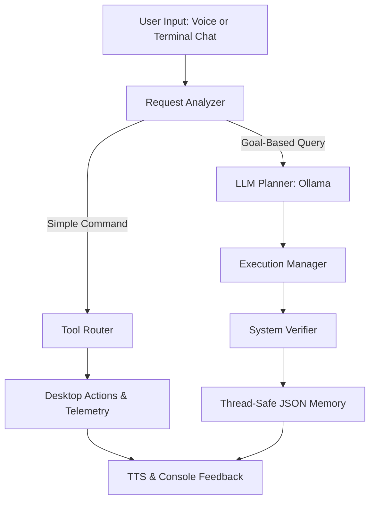

# 🤖 Jay AI Assistant

A high-performance, modular **Autonomous AI Assistant** designed for desktop automation, offline speech recognition, and intelligent conversational reasoning. Built with a clean **9-step event pipeline**, Jay offers both an instant **Terminal Chat Mode** and a seamless **Voice Activation Mode**.

---

## 🌟 Key Highlights

- **Dual-Mode Interaction**:
  - **Terminal Chat Mode (Default)**: Instant startup with zero microphone or background CPU overhead. Type commands or chat directly.
  - **Voice Mode**: Seamless toggle into voice activation via `voice mode`. Wake Jay using your custom wake word (`"Hey Jay"`) or switch back to chat via `"text mode"`.
- **100% Offline Speech Recognition**: Powered by local `faster-whisper` (`small.en` / `base.en`) with integrated Voice Activity Detection (VAD) to filter room noise and keyboard clicks.
- **Sliding-Window Wake Word Engine**: 2.2-second circular rolling buffer with audio peak normalization—ensuring 100% detection reliability with zero dead zones or split-phrase cutoffs.
- **Low-Latency Neural Speech Output**: Streaming voice synthesis via Microsoft Edge TTS with in-memory `pygame.mixer` audio playback (<300ms latency) and real-time voice interruption.
- **Zero-Latency Tool Router**: Instant execution of desktop system tasks (volume, battery, CPU/RAM telemetry, screenshots, app launching/closing) without LLM latency.
- **Local AI Brain with Contextual Memory**: Powered by local Ollama (`mistral`), featuring structured session context separation so Jay never gets stuck on past topics.

---

## 🏗️ Architecture Pipeline

Jay follows a modular 9-stage architecture separating direct system automation from deep LLM reasoning:



---

## 📂 Project Structure

```
jay_assisstant/
├── .env.example          # Environment variable template
├── .gitignore            # Git exclusion rules (virtual environments, cache, keys)
├── README.md             # Project documentation & guide
├── actions.py            # Desktop automation, telemetry, and web searches
├── analyzer.py           # Request analyzer & instant tool router
├── audio_engine.py       # Audio capture, Faster-Whisper STT & Pygame TTS
├── config.py             # Global state, thread locks, and configuration settings
├── jay.py                # Master orchestrator (dual Chat & Voice loops)
├── memory.py             # Thread-safe persistent JSON conversation store
├── planner.py            # Ollama LLM integration & session management
├── record_wake_word.py   # Utility script to record custom wake-word samples
├── requirements.txt      # Python dependencies
├── start_jay.bat         # Instant launcher script for Windows
├── test_speech.py        # Audio output verification utility
├── test_wake.py          # Wake-word testing script
└── wake_word.py          # Sliding-window wake-word detector
```

---

## 🚀 Getting Started

### 1. Prerequisites
- **Operating System**: Windows 10 / 11
- **Python**: Version 3.10 or 3.11 recommended
- **Ollama**: [Download Ollama](https://ollama.ai) and pull your preferred local model:
  ```powershell
  ollama pull mistral
  ```

### 2. Installation

1. **Clone the Repository**:
   ```bash
   git clone https://github.com/saicharan2809/jay_assisstant.git
   cd jay_assisstant
   ```

2. **Create and Activate a Virtual Environment**:
   ```powershell
   python -m venv jay_env
   .\jay_env\Scripts\activate
   ```

3. **Install Dependencies**:
   ```powershell
   pip install -r requirements.txt
   ```

4. **Configure Environment Variables**:
   Copy `.env.example` to `.env` and adjust your preferred settings:
   ```powershell
   copy .env.example .env
   ```

---

## ⚙️ Configuration (`.env`)

| Variable | Default | Description |
| :--- | :--- | :--- |
| `OLLAMA_MODEL` | `mistral` | Local LLM used for multi-step reasoning and conversations. |
| `WHISPER_MODEL` | `small.en` | Local Whisper model (`tiny.en`, `base.en`, `small.en`). |
| `TTS_VOICE` | `en-US-GuyNeural` | Natural Edge-TTS voice (e.g. `en-US-GuyNeural`, `en-US-AriaNeural`). |
| `INTERRUPT_MULTIPLIER` | `4.0` | Ambient threshold multiplier for speech interruption sensitivity. |
| `BROWSER_PATH` | Chrome/Comet path | Default browser path for web actions and searches. |

---

## 💻 Usage

Launch Jay using the instant batch script:
```powershell
.\start_jay.bat
```
*(Or directly via Python: `python jay.py`)*

### 1. Terminal Chat Mode (Default)
Jay starts immediately in text chat mode:
```text
==================================================
💬 Jay Terminal Chat Mode Active
• Type your message or system command directly below.
• Type 'voice mode' to switch to Voice Activation.
• Type 'exit' or 'quit' to close Jay.
==================================================

You > check battery
Jay: Battery is at 88% and discharging.

You > what is quantum entanglement?
Jay: Quantum entanglement is a phenomenon where...
```

### 2. Switching to Voice Mode
Type `voice mode` at the prompt:
```text
You > voice mode
[🎤] Calibrating microphone for Voice Mode...
🎤 Jay Voice Mode Active
• Say 'Hey Jay' to activate listening.
• Say 'text mode' to switch back to Terminal Chat.
• Say 'sleep' to put Jay on standby.
```
- Say **"Hey Jay"** to wake him up.
- Speak your command: *"Open YouTube"*, *"Volume up"*, *"Check CPU usage"*, *"Take a screenshot"*.
- Say **"Text mode"** anytime to switch back to keyboard input.

---

## 🛠️ Built-in Capabilities

- **Audio Controls**: Volume up, volume down, mute.
- **Hardware Diagnostics**: Battery status, CPU load across cores, RAM consumption, disk space.
- **Application Management**: Open & close apps (Notepad, Calculator, VS Code, Task Manager, etc.).
- **Desktop Automation**: Screenshots (saved to `Pictures/Screenshots`), mouse clicks, scrolling.
- **Web Navigation**: Deep searches on YouTube, Google, Amazon, Flipkart, Spotify, GitHub, Wikipedia.
- **Speech Interruption**: Talk over Jay while he is speaking to cut him off instantly.

---

## 🗺️ Roadmap: Towards Full Agent Autonomy (JARVIS / EDITH)

- [ ] **Multimodal Screen Eyes (VLM)**: Analyze code errors, graphs, and open windows directly on screen.
- [ ] **Autonomous Browser Agent (Playwright)**: Multi-step web navigation, form filling, and research scraping.
- [ ] **Lifelong Episodic Memory (Vector DB)**: Semantic memory storing facts and preferences across sessions.
- [ ] **Proactive System Daemon**: Proactive background alerts for low battery, high CPU spikes, and calendar schedules.
- [ ] **Sci-Fi Audio SFX**: Futuristic activation chimes and thinking acoustic feedback.

---

## 📄 License
This project is open-source and available under the [MIT License](LICENSE).
